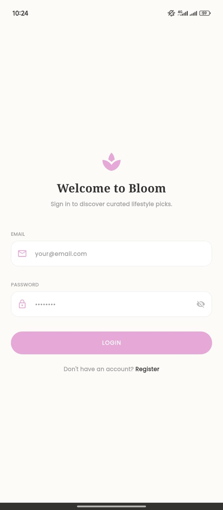
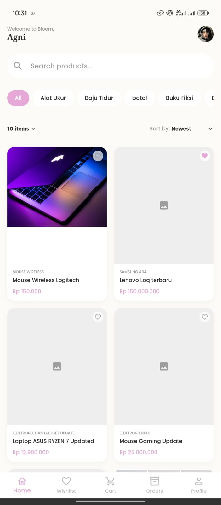
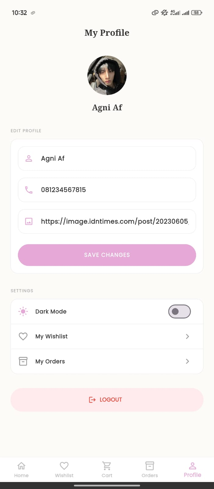
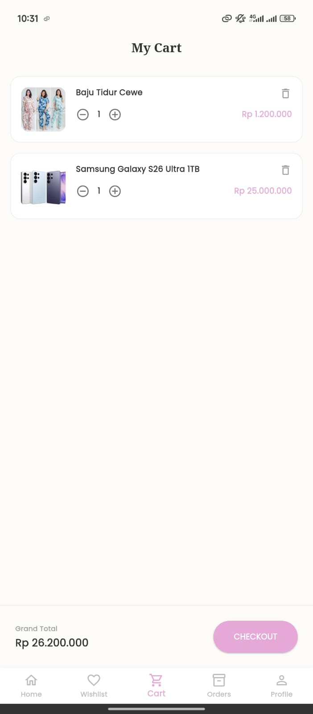
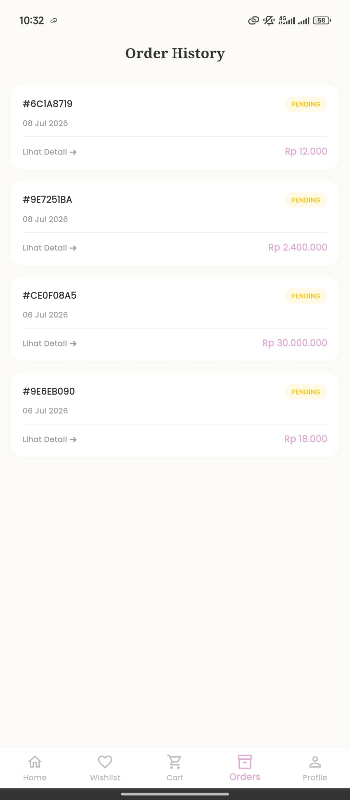
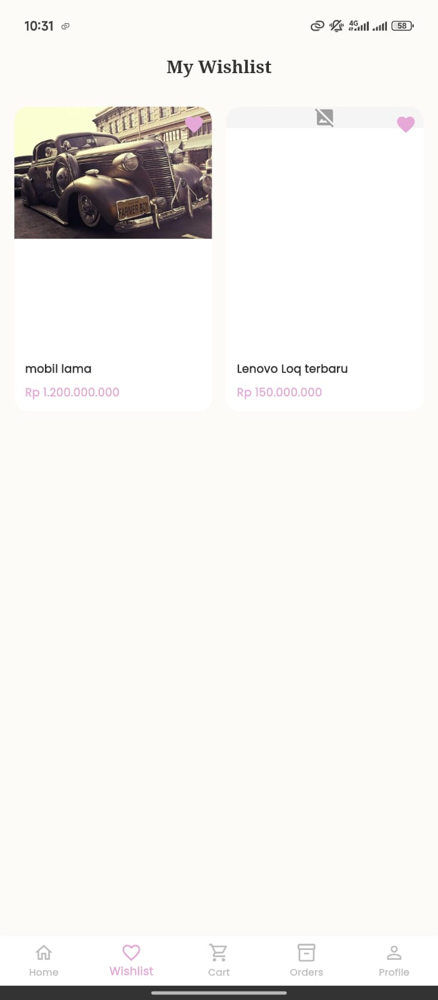

# 🌸 Bloom App - E-Commerce Fashion Mobile

Aplikasi E-Commerce modern berbasis Flutter yang dibangun untuk memenuhi Ujian Akhir Semester (UAS) mata kuliah **Praktikum Pemrograman Mobile**. Aplikasi ini telah terintegrasi dengan REST API yang disediakan dan dilengkapi dengan sistem Autentikasi, Katalog Produk, Keranjang Belanja, hingga riwayat Pemesanan.

## 👨‍💻 Identitas Mahasiswa
- **Nama**  : Aghniya Afiatul Jannah
- **NIM**   : 2306035
- **Kelas** : B

---

## ✨ Daftar Fitur yang Diimplementasikan
Aplikasi ini telah memuat seluruh fitur fungsionalitas yang disyaratkan pada UAS, antara lain:

1. **🔐 Autentikasi & Profil**
   - Registrasi dan Login menggunakan JWT Token API.
   - Fitur *Auto-Login* (Sesi tersimpan di *SharedPreferences*).
   - Menampilkan dan Mengubah profil (*Nama* dan *No Telepon*).
   - Fitur Logout.

2. **🛍️ Katalog Produk & Pencarian**
   - Menampilkan daftar produk menggunakan *GridView/ListView*.
   - Fitur Filter Kategori & Pencarian produk (Search).
   - *Sorting* berdasarkan harga termurah, termahal, dan terbaru.
   - Halaman Detail Produk lengkap dengan ulasan (*reviews*).

3. **🛒 Keranjang Belanja (Cart)**
   - Menambahkan produk ke keranjang.
   - Menambah (`+`) / mengurangi (`-`) dan menghapus kuantitas item.
   - Menghitung Total Harga (*Grand Total*) secara *real-time*.
   - Fitur kosongkan keranjang (dengan dialog konfirmasi).

4. **📦 Pemesanan (Checkout & Orders)**
   - Proses Checkout dengan formulir alamat pengiriman dan catatan.
   - Menampilkan Riwayat Pesanan beserta statusnya (Pending, Processing, Shipped, Delivered).
   - Warna indikator yang berbeda untuk setiap status pesanan.
   - Halaman detail transaksi pemesanan lengkap.

5. **🌙 Fitur Tambahan (Lanjutan)**
   - **Dark Mode**: Menggunakan *ThemeProvider*, tersimpan di perangkat agar tema tidak hilang saat aplikasi ditutup.
   - **State Management**: Seluruh alur data dikelola dengan rapi menggunakan `Provider`.
   - **Dokumentasi Lengkap**: Semua *class* dan *method* telah didokumentasikan dengan bahasa Indonesia yang jelas.

---

## 📸 Screenshot Aplikasi
Berikut adalah tampilan antarmuka (UI) dari aplikasi Bloom:

| Login & Register | Home / Katalog | Detail Produk |
| :---: | :---: | :---: |
|  |  |  |

| Keranjang (Cart) | Checkout & Order | Profil |
| :---: | :---: | :---: |
|  |  |  |


---

## 🚀 Cara Menjalankan Aplikasi

Ikuti langkah-langkah di bawah ini untuk menjalankan *project* secara lokal di komputer Anda:

### 1. Clone Repository
Buka terminal Anda dan ketikkan perintah berikut untuk mengunduh kode aplikasi:
```bash
git clone https://github.com/aghniyaaj/tugasbesar_2306035.git```

### 2. Masuk ke Folder Project
Pindah ke direktori folder yang baru saja di-clone:
```bash
cd tugasbesar_2306035```

### 3. Install Dependensi (Packages)
Unduh dan sinkronkan semua packages flutter yang digunakan dalam aplikasi:
```bash
flutter pub get```

### 4. Jalankan Aplikasi
Pastikan Emulator Android atau smartphone Anda sudah terhubung (Debug mode), kemudian ketik:
```bash
flutter run```

### Menjalankan Aplikasi Langsung
Untuk menjalankan aplikasi langsung di perangkat mobile dapat mengunduh file apk pada folder release/app-release.apk atau melalui link drive https://bit.ly/4fpOXgu
